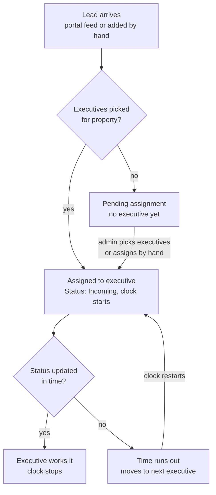

# RealtyAdwise Portal – System Workflow & QA Guide

## 1. Overview

RealtyAdwise is a lead-management portal. Property enquiries from 99Acres and MagicBricks (or added by hand) are routed to sales executives, who must act on each lead within a time limit. Three roles use it, each with a separate login and screens.

| Role | Login URL | What they do |
| --- | --- | --- |
| Admin | `/admin/login` | Full control: leads, properties, clients, managers, executives, teams, settings |
| Manager | `/manager/login` | Sees leads of the teams they lead, assigns/reassigns leads, views team members |
| Executive (Sales) | `/executive/login` | Sees only their own leads, calls/WhatsApps clients, updates lead status |

How it is built, in tester terms:

- Web app (Next.js) that works on desktop and phone, and can be installed as an app. Admin, manager and executive lead pages, lead details and the admin overview refresh on their own every 15 seconds while the tab is open, so status and assignment changes appear without reloading.
- The browser never talks to the backend directly. Every action goes through the portal's server, which calls the backend API (hosted on Render).
- The backend runs on a free tier, so the first request after idle can take up to ~30 seconds. A "waking up" hint appears after 4 seconds; a request fails after 60 seconds. This is not a bug.
- Times are shown in Indian Standard Time (IST). Budgets show as Lakh / Cr (e.g. 8000000 shows as ₹80 Lakh).

## 2. Login, session and access

Each role signs in on its own page with email and password (not username). Using the wrong role's page, an unknown email, a wrong password or a deactivated account all show the same message: "Invalid email or password". That is intended.

**Session rules to test**

- The session lasts 1 hour (the life of the login token). There is no "remember me" and no refresh.
- Opening a protected page while signed out sends you to that role's login with a `next` link, and you land on the original page after signing in.
- Opening your own login page while already signed in sends you to your home page.
- A manager opening an `/admin` page (or any role opening another role's area) is sent to that area's login page.
- If the token expires, the account is deactivated or its password is reset, the next click signs you out and the login page says the session ended.
- More than 10 login attempts in 15 minutes shows a "try again in N minutes" message. The limit is shared by everyone on the same server, so run login tests in one batch.
- Sign out clears the session and returns to that role's login page.

**What each role can open**

| Area | Admin | Manager | Executive |
| --- | --- | --- | --- |
| Overview / dashboard | Yes (`/admin`) | Yes (`/manager`) | No; lands on My leads |
| Leads, filtered by property and executive | All leads | Leads of their own teams | Only leads assigned to them |
| Add a lead by hand | Yes | No | No |
| Assign or reassign a lead | Yes | Yes | No |
| Change lead status | Yes | No (view only) | Yes, own leads only |
| Mark a lead Important (star) | Yes | Yes | Yes (private to each user) |
| Properties, Clients | Yes | No | No |
| Managers, Executives, Teams | Create, edit, activate, reset password | Team page, read only | No |
| Settings (assignment rule, response time) | Yes | No | No |

## 3. End-to-end lead workflow

A lead is a client's enquiry about one property. It moves from arrival, to an executive, to a final outcome.

A lead that nobody touches is handed to the next executive when the clock runs out.

**Step by step**

1. **Lead arrives.** From the 99Acres or MagicBricks feed, or an admin uses Leads, then Add lead. Name, mobile, property name and source are required.
2. **Property and client are matched.** A new property is created if the name is new. A client with the same mobile number is reused, so the lead shows "Previous enquiries". The same source plus external lead ID returns the existing lead and does not create a duplicate.
3. **Routing.** The lead goes to one of the executives picked for that property, one after another by the order their accounts were created. Inactive executives are skipped. Each property keeps its own turn. Assigning by hand does not change whose turn is next. An inactive property rejects new leads.
4. **No executives picked.** The lead waits as Pending assignment. When an admin saves executives for that property, waiting leads are assigned and the message says how many (e.g. "2 pending leads were assigned").
5. **Executive is notified.** The lead shows a New tag and a toast "N new lead(s) assigned to you" appears within about 15 seconds. Opening the lead clears the New tag.
6. **Executive acts.** Call or WhatsApp the client from the lead, then set the status. A reminder reads "Update the status by 3:45 pm, or this lead moves to the next executive".
7. **Time runs out.** The clock counts 24/7 from assignment. Opening the lead does not stop it, only a status change does. After the limit the lead moves to the next eligible executive and their clock starts. If nobody else is eligible it stays where it is. Assigning by hand restarts the clock.
8. **Admin and manager see the SLA too.** While a lead is Incoming, its card and detail page show "SLA running: <executive> must update the status by <time>". Admin sees the time based on the real response time from Settings (detail page also shows the minutes). Manager sees it based on the 90-minute default, because only admins can read the setting.
9. **History.** Each assignment is logged on the property page as Rotation, Manual or Timed out, with the date and who assigned it.

**Lead statuses**

| Status | Meaning | Who can set it |
| --- | --- | --- |
| Pending assignment | No executive yet | System only. Cannot be picked in the status list. |
| Incoming | Assigned, not yet worked. The clock runs in this status. | System, on assignment |
| Ringing | Executive is trying to reach the client | Admin, executive |
| Connected | Executive spoke to the client | Admin, executive |
| Closed | Deal or enquiry finished | Admin, executive |
| Lost | Client no longer interested | Admin, executive |
| Broker | Client is a broker | Admin, executive |

Status cannot be changed while a lead is Pending assignment. The portal does not force an order between statuses, so any can be picked from any other.

## 4. Screens and what they do

**Admin**

| Screen | Path | What it does | Rules worth knowing |
| --- | --- | --- | --- |
| Overview | `/admin` | Counts (leads today, pending, properties needing executives, active executives), latest leads, a "Needs attention" list | Shows "All caught up" only when every active property has executives and every executive has a team |
| Leads | `/admin/leads` | Search and filter by status, property, executive, Important only. Open a lead to see details, change status, assign or reassign | 50 leads per page (20 for executives). Search matches client, mobile, email or property |
| Add lead | `/admin/leads/new` | Creates a lead by hand | Budget is numbers only (rupees). Client type applies only when a new client is created |
| Properties | `/admin/properties` | List with executive count and pending leads. Open one to pick its executives, edit details, activate or deactivate, see recent assignments | Properties are created from leads, there is no Add property. Saving the executive list replaces it, so unticked executives are removed |
| Clients | `/admin/customers` | List and detail of clients with their enquiries | Name and email can be edited. Mobile number cannot be changed |
| Managers | `/admin/managers` | Create, edit, activate or deactivate, reset password, delete | Resetting a password signs that person out everywhere. Password minimum 8 characters |
| Executives | `/admin/executives` | Create, edit, activate or deactivate, reset password, move between teams, delete | Designation (Sales Executive or Executive Manager) is a label only, access is the same. Needs a unique email and username |
| Teams | `/admin/teams` | Create and edit a team, give it a manager, activate or deactivate, see members | Team names are unique. Teams are deactivated, not deleted. An executive can only join an active team |
| Settings | `/admin/settings` | Pick the assignment rule and the lead response time | The response time has a minimum and maximum shown under the field |

**Manager**

| Screen | Path | What it does |
| --- | --- | --- |
| Overview | `/manager` | Counts for leads needing assignment, Important leads, active executives and teams, plus latest leads |
| Leads | `/manager/leads` | Same filters as admin, limited to the manager's teams. Open a lead to assign or reassign it. Status is view only |
| Team | `/manager/team` | Teams the manager leads and their executives. Tap an executive to see their leads. Shows a message if the manager leads no team |

**Executive**

| Screen | Path | What it does |
| --- | --- | --- |
| My leads | `/executive` | Own leads only, with counts per status, a "N new" badge, search, status filter, Important filter and paging |
| Lead detail | `/executive/leads/[id]` | Client details, Call and WhatsApp buttons, update status, previous enquiries from the same client |

**On every lead card**

- Call opens the phone dialer. WhatsApp opens a chat with the number in a new tab.
- Important star: click on desktop, long-press on a phone. Saved per user, so one person's star is not visible to another.
- A lead card shows its number, property, requirement, budget, source, assigned executive and date.

## 5. Test scenarios

Run these in order the first time, because later ones need the data earlier ones create. Mark each Pass or Fail and note the lead number or screen when something fails.

| ID | Area | Steps | Expected result | Pass/Fail |
| --- | --- | --- | --- | --- |
| L1 | Login | Sign in on `/admin/login` with a valid admin email and password | Lands on `/admin` with the admin's first name in the greeting | |
| L2 | Login | Sign in with a wrong password, then with an executive's email on the admin page | Both show "Invalid email or password". No hint which part was wrong | |
| L3 | Login | While signed out, open `/admin/leads` directly | Redirected to admin login. After signing in you land on `/admin/leads` | |
| L4 | Login | Signed in as manager, open `/admin/properties` | Redirected to the admin login page, not shown admin data | |
| L5 | Login | Show/hide password button on every login page | Password toggles between hidden and visible | |
| L6 | Login | Sign out, then press the browser Back button | Login page, no protected data visible | |
| T1 | Teams | Admin creates team "QA Team A" with a description and no manager | Appears in Teams list, active, 0 executives | |
| T2 | Teams | Create a second team with the same name (different capitals) | Error: name already exists | |
| E1 | Executives | Create two executives in "QA Team A" (unique email, username, 8+ character password) | Both listed, active, in the team | |
| E2 | Executives | Create an executive with a duplicate email or username | Field error next to the input, nothing created | |
| E3 | Executives | Sign in as the new executive on `/executive/login` | Lands on My leads, empty list | |
| E4 | Executives | Deactivate an executive, then try to sign in as them | Sign-in fails with the generic message. If already signed in, the next click ends the session | |
| E5 | Executives | Reset an executive's password | Old password stops working, new one works | |
| M1 | Managers | Create a manager, then edit the team to make them its manager | Manager can sign in. `/manager/team` shows that team and its executives | |
| M2 | Managers | Manager signs in with no team assigned | Team page says they lead no teams. Leads list is empty | |
| P1 | Properties | Add a lead (see D1) for a new property name | Property appears with 0 executives and 1 pending lead | |
| P2 | Properties | Open the property, tick both executives, Save | Message says 1 pending lead was assigned. Property shows 2 executives | |
| P3 | Properties | Untick one executive and Save | Executive removed from the list. Existing leads stay with whoever has them | |
| P4 | Properties | Deactivate a property, then add a lead for it | Lead is rejected with an error. Activate it and the lead works | |
| D1 | Add lead | Admin: Leads, Add lead. Fill name, mobile, property, source. Submit | Redirects to the lead page with "Lead saved and assigned to …" if executives exist | |
| D2 | Add lead | Submit with an empty required field, budget "abc", or a bad email | Error next to each field. Form keeps what was typed | |
| D3 | Add lead | Submit twice with the same source and external lead ID | Second submit returns the same lead, no duplicate | |
| D4 | Add lead | Add another lead with the same mobile for a different property | Same client reused. Lead page lists the earlier enquiry under Previous enquiries | |
| R1 | Routing | Add 4 leads for a property with 2 executives | Leads alternate between the two executives. Recent assignments shows "Rotation" | |
| R2 | Routing | Admin assigns a lead by hand to the executive whose turn it is not | Lead moves. History shows "Manual" and who assigned it. The next automatic lead still follows the old rotation | |
| R3 | Routing | Deactivate one executive of a two-executive property and add 2 leads | Both go to the active executive | |
| R4 | Routing | Settings: choose another assignment rule, Save, add a lead | Message says it applies to the next lead. Earlier leads do not change | |
| V1 | SLA view | Admin: assign a lead, open Leads and the lead detail | Incoming lead shows "SLA running: <name> must update the status by <time>". Time = assigned time + response time from Settings | |
| V2 | SLA view | Admin changes the response time in Settings, then reopens the lead | Deadline time on the lead moves accordingly | |
| V3 | SLA view | Executive changes the status; watch the admin Leads list without reloading | Within about 15 seconds the badge changes and the SLA message disappears | |
| V4 | Real time | Admin has a lead open. Manager reassigns it | Within about 15 seconds the admin page shows the new executive | |
| X1 | Executive | Signed in as executive, have an admin add a lead for their property | Within about 15 seconds a toast "1 new lead assigned to you" and a New tag appear without reloading | |
| X2 | Executive | Open that lead | New tag clears. Call, WhatsApp and the update-by reminder show for an Incoming lead | |
| X3 | Executive | Change status to Ringing, then Connected, then Closed | Each save shows "Status updated." Badge and list counts change. The update-by reminder disappears after the first change | |
| X4 | Executive | Try to open another executive's lead by its address | Not found page, no data from that lead | |
| X5 | Executive | Mark a lead Important (star), then filter Important only | Only starred leads show. Other users' stars do not appear | |
| S1 | Timeout | Settings: set response time to the minimum, Save. Assign a lead and do nothing | After the time passes the lead moves to the other executive. History shows "Timed out" | |
| S2 | Timeout | Repeat S1 but only open the lead, no status change | Lead still moves. Opening does not stop the clock | |
| S3 | Timeout | Repeat S1 with a single-executive property | Lead stays with that executive | |
| S4 | Timeout | Repeat S1 but change the status before time is up | Lead stays. No "Timed out" entry | |
| S5 | Timeout | Enter 0, a decimal, text or a number outside the limits | Error. Value is not saved | |
| A1 | Manager | Manager opens a pending lead and picks an executive | "Lead assigned." Lead shows under that executive | |
| A2 | Manager | Manager opens a lead and looks for a status control | No status control. Assign or reassign only | |
| A3 | Manager | Manager lists leads | Only leads for their teams | |
| F1 | Filters | Admin leads: search by name, mobile, property. Combine with status and executive filters. Open page 2 when there are more than 50 | Results match every filter. Paging keeps the filters | |
| F2 | Filters | Dashboard cards: click Pending and Need executives | Lands on the matching filtered list | |
| U1 | UI | Open the portal at phone width (~375 px) and desktop | Bottom navigation on phone. Call and WhatsApp bar sits above it. No horizontal scrolling | |
| U2 | UI | Toggle dark and light theme | All screens readable in both | |
| U3 | UI | Open a page that does not exist, e.g. `/admin/nothing` | Friendly not-found page | |

## 6. Test data, environment and known behaviours

**Set up before testing**

- One admin account (from the developer). Create the rest yourself: 1 manager, 1 team led by that manager, 2 executives in the team, plus 1 executive with no team.
- Use fake mobile numbers and a name prefix such as "QA" so test leads are easy to find and clean up.
- Keep two browsers (or one normal and one private window) so you can be admin and executive at once.
- The first request after the backend has been idle can take about 30 seconds. Wait before reporting a hang. After 60 seconds a request fails.

**Behaviours that look like bugs but are intended**

- Every failed login shows the same message, whatever the cause.
- Pages refresh every 15 seconds, and only while the tab is visible. A hidden tab updates when you switch back to it.
- The "update the status by" time shown to managers and executives uses a fixed 90-minute limit. If an admin changes the response time in Settings, their time can differ from the real deadline. Admin screens use the real value.
- Opening a lead only clears the New tag. It does not stop the response clock.
- Properties cannot be added by hand. They come from leads.
- Teams and properties are deactivated, not deleted.
- A client's mobile number cannot be edited.
- Logins all come from the portal server, so the 10-attempts-in-15-minutes limit is shared by every tester.

**Report these with steps and a screenshot**

- Any role seeing data it should not (another executive's lead, admin pages as manager).
- A lead that is assigned to nobody and not Pending, or assigned to an inactive executive.
- A lead that moves even though its status was changed in time.
- Duplicate leads from the same source and external ID.
- Layout breaking at phone width, or unreadable text in dark theme.

**Open questions to confirm with the developer**

- Which assignment rules exist besides rotation (read from the backend; record the names you see on Settings).
- The default, minimum and maximum response time (shown on Settings).
- Exactly which leads a manager can see, and whether leads of an executive who changes teams stay visible.
